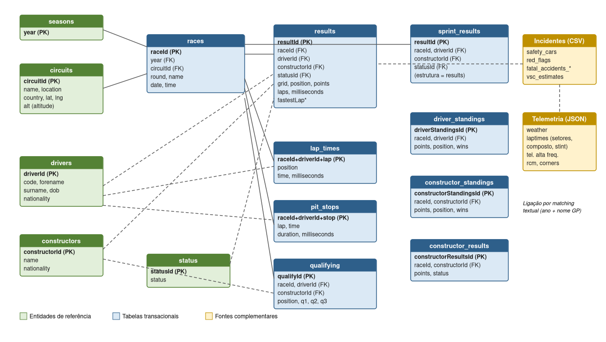
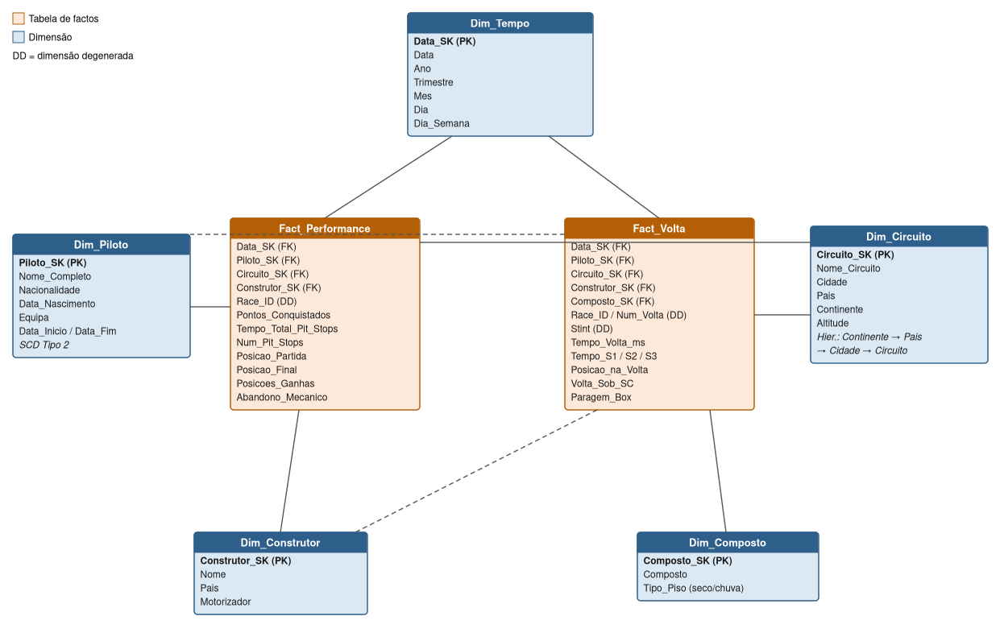

**Resumo** — Este relatório documenta as fases de conceção de uma solução de *Business Intelligence* aplicada ao domínio da Formula 1, desenvolvida no âmbito da unidade curricular de Business Intelligence. São apresentados os objetivos do projeto, os promotores e requisitos levantados junto de *stakeholders* simulados, as dez questões de análise que orientam a solução, o estudo das fontes de dados originais e respetivos metadados, e a conceção do modelo dimensional em esquema em estrela (constelação de factos), incluindo a matriz de mapeamento entre as fontes de origem e o *data warehouse* de destino. O modelo proposto integra dados históricos de 77 épocas (1950–2026), dados de incidentes de corrida e telemetria recente, suportando análises de estratégia de paragens, fiabilidade mecânica, consistência de pilotos e impacto do *Safety Car*.

**Palavras-chave** — Business Intelligence; Data Warehouse; Modelo Dimensional; Star Schema; ETL; Formula 1.

# 1. Introdução

A Formula 1 é um dos desportos mais orientados a dados do mundo: cada fim de semana de Grande Prémio gera milhões de pontos de dados de cronometragem, telemetria, meteorologia e decisões estratégicas. Este projeto propõe a construção de uma solução completa de *Business Intelligence* (BI) sobre dados históricos e recentes da Formula 1, percorrendo todas as etapas de um projeto de BI: levantamento de requisitos, estudo das fontes e metadados, conceção do modelo dimensional, implementação e refrescamento do *data warehouse* (DW), análise de dados em *dashboards* e narração da história dos dados.

O presente relatório foca as três primeiras fases do projeto: a **conceção** (Secção 2), o **estudo das fontes de dados origem e dos seus metadados** (Secção 3) e a **conceção e desenvolvimento do modelo dimensional** (Secção 4). As fases de integração de dados (ETL), análise e *storytelling* serão documentadas em secções subsequentes do relatório final.

# 2. Conceção do Projeto

## 2.1. Objetivos

O objetivo geral é desenvolver uma solução de BI que consolide dados históricos de corridas, pilotos, construtores e circuitos de Formula 1, para responder a questões estratégicas e de performance sobre o desporto. Definem-se quatro objetivos específicos:

* Construir um *data warehouse* dimensional (esquema em estrela) a partir de fontes OLTP históricas;
* Implementar *pipelines* ETL para extração, transformação e carga dos dados, com refrescamento incremental;
* Desenvolver *dashboards* analíticos para apoio à decisão de equipas e analistas;
* Produzir uma narrativa de dados (*storytelling*) intitulada "A Anatomia de uma Vitória", dirigida a uma plateia-alvo.

## 2.2. Promotores e Stakeholders

| Papel | Entidade / Foco |
|---|---|
| Promotor académico | UC de Business Intelligence, Mestrado em Ciência de Dados |
| Sponsor do projeto | Direção de Desporto Motorizado da FIA / equipas de F1 (*stakeholder* simulado) |
| Diretor Técnico | Fiabilidade e performance mecânica |
| Estrategista de Corrida Chefe | Estratégias de paragens e degradação de pneus |
| Analista de Dados Sénior | Métricas de consistência e ultrapassagens |
| Utilizadores-alvo | Estrategistas de corrida, analistas de performance, jornalistas especializados e comentadores técnicos |

## 2.3. Levantamento de Requisitos

Os requisitos foram levantados através de análise documental do desporto (regulamentos FIA, relatórios técnicos de época), da exploração dos *datasets* históricos disponíveis e de entrevistas simuladas com três perfis de *stakeholders* típicos de uma equipa de F1 (Diretor Técnico, Estrategista de Corrida Chefe e Analista de Dados Sénior), complementadas com o perfil de Jornalista Especializado/Comentador Técnico para a vertente de narrativa.

**Requisitos de negócio.** As entrevistas revelaram três necessidades prioritárias: comparação direta de performance entre equipas; previsão de degradação de pneus por circuito; e avaliação de custo-benefício dos investimentos técnicos.

**Requisitos técnicos.** Fontes em formato CSV e JSON (dados históricos, incidentes e telemetria); ETL em Python (pandas) com orquestração em SQL Server Integration Services (SSIS); armazenamento em SQL Server; visualização em Power BI; modelo dimensional em esquema em estrela; refrescamento incremental agendado nas 24 horas após cada Grande Prémio.

**Requisitos de qualidade.** Validação de integridade referencial entre factos e dimensões; monitorização de duplicados nas tabelas de dimensão (por chave de negócio); registo de métricas de qualidade do carregamento (linhas carregadas e rejeitadas) para auditoria.

## 2.4. Questões de Análise

Definiram-se dez questões de análise, alinhadas com os objetivos de negócio, que a solução deve responder:

1. Qual é a evolução histórica do tempo médio de *pit stop* por construtor ao longo das épocas?
2. Existe correlação direta entre a posição de qualificação (*pole position*) e a vitória final na corrida em circuitos de diferente altitude?
3. Quais os construtores com maior taxa de abandono por falha mecânica em condições de temperatura elevada?
4. Como varia a consistência de tempos por volta de um piloto quando este transita de pneus macios para duros?
5. Qual o impacto estatístico da entrada do *Safety Car* na alteração das posições finais do Top 10?
6. Em que setor da volta (S1, S2 ou S3) ocorrem mais ultrapassagens em cada circuito?
7. Qual é a distribuição geográfica dos pontos conquistados por nacionalidade de pilotos nos últimos 20 anos?
8. Que pilotos apresentam maior ganho líquido de posições na primeira volta da corrida a partir de posições intermédias da grelha (P10–P15)?
9. Qual é a eficácia de estratégias de *undercut* vs. *overcut* com base no desgaste real dos pneus?
10. Qual o impacto do número de paragens nas boxes (estratégia de 2 vs. 3 *stops*) na posição final do piloto?

## 2.5. Entrevistas Diligenciadas e User Stories

Das entrevistas simuladas resultaram onze *user stories*, que ligam cada questão de análise a um perfil de utilizador e a um benefício de negócio concreto.

**Diretor Técnico** (fiabilidade e performance mecânica):

* *US1* — Como Diretor Técnico, quero comparar o tempo de *pit stop* da minha equipa com os concorrentes diretos, para identificar janelas de otimização mecânica.
* *US2* — Como Diretor Técnico, quero analisar a taxa de abandono por falha mecânica em condições de temperatura elevada, para avaliar a robustez do motor e dos sistemas do carro.

**Estrategista de Corrida Chefe** (estratégia de paragens e pneus):

* *US3* — Como Estrategista de Corrida, quero simular o impacto de janelas de paragem com base no histórico de degradação de pneu por circuito, para mitigar o risco de perda de posição em pista.
* *US4* — Como Estrategista de Corrida, quero comparar a eficácia de estratégias de *undercut* vs. *overcut* em cada circuito, para maximizar o ganho de posições nas paragens.
* *US5* — Como Estrategista de Corrida, quero avaliar o impacto do número de paragens (2 vs. 3 *stops*) na posição final do piloto, para definir a estratégia ótima para cada corrida.

**Analista de Dados Sénior** (consistência e ultrapassagens):

* *US6* — Como Analista de Dados Sénior, quero analisar a consistência de tempos por volta de um piloto quando transita de pneus macios para duros, para avaliar a adaptabilidade e gestão de pneus.
* *US7* — Como Analista de Dados Sénior, quero identificar os pilotos com maior ganho líquido de posições na primeira volta a partir de posições intermédias da grelha (P10–P15), para detetar talentos em equipas de meio do pelotão.
* *US8* — Como Analista de Dados Sénior, quero correlacionar a *pole position* com a vitória final, segmentado por altitude do circuito, para entender a vantagem competitiva da qualificação em diferentes tipos de circuito.

**Jornalista Especializado / Comentador Técnico** (narrativa e contexto):

* *US9* — Como Jornalista Especializado, quero visualizar a distribuição geográfica dos pontos conquistados por nacionalidade de pilotos nos últimos 20 anos, para identificar tendências e hegemonias regionais no desporto.
* *US10* — Como Comentador Técnico, quero analisar o impacto da entrada do *Safety Car* nas posições finais do Top 10, para explicar ao público reviravoltas inesperadas nos resultados.
* *US11* — Como Comentador Técnico, quero identificar o setor da volta (S1, S2 ou S3) com mais ultrapassagens em cada circuito, para enriquecer a narração em tempo real durante as transmissões.

# 3. Estudo das Fontes de Dados Origem e Metadados

## 3.1. Inventário das Fontes

O repositório de dados do projeto contém **22 fontes**, organizadas em três categorias: dados tabulares históricos (14 ficheiros CSV, derivados da base de dados Ergast/Kaggle de Formula 1), dados de incidentes e segurança (5 ficheiros CSV/JSON) e dados de telemetria e sessão (estrutura hierárquica de ficheiros JSON por época/Grande Prémio/sessão, 2024–2026).

**Tabela 1 — Dados tabulares históricos (CSV)**

| Ficheiro | Linhas | Chave primária | Período |
|---|---:|---|---|
| `circuits` | 78 | `circuitId` | — |
| `constructor_results` | 12 931 | `constructorResultsId` | 1958–2026 |
| `constructor_standings` | 13 697 | `constructorStandingsId` | 1958–2026 |
| `constructors` | 214 | `constructorId` | — |
| `driver_standings` | 35 493 | `driverStandingsId` | 1950–2026 |
| `drivers` | 865 | `driverId` | — |
| `lap_times` | 872 521 | `raceId`+`driverId`+`lap` | 1996–2026 |
| `pit_stops` | 22 335 | `raceId`+`driverId`+`stop` | 2011–2026 |
| `qualifying` | 11 102 | `qualifyId` | 2003–2026 |
| `races` | 1 171 | `raceId` | 1950–2026 |
| `results` | 27 370 | `resultId` | 1950–2026 |
| `seasons` | 77 | `year` | 1950–2026 |
| `sprint_results` | 546 | `resultId` | 2021–2026 |
| `status` | 140 | `statusId` | — |

**Tabela 2 — Dados de incidentes e segurança**

| Ficheiro | Registos | Conteúdo |
|---|---:|---|
| `safety_cars.csv` | 370 | Intervenções de *Safety Car* (1973–2024) |
| `red_flags.csv` | 99 | Interrupções por bandeira vermelha (1950–2024) |
| `fatal_accidents_drivers.csv` | 51 | Acidentes fatais com pilotos (1952–2015) |
| `fatal_accidents_marshalls.csv` | 5 | Acidentes fatais com comissários (1963–2001) |
| `virtual_safety_car_estimates.json` | 78 | Voltas estimadas sob VSC por GP (2015–2024) |

**Dados de telemetria e sessão.** Organizados em diretórios `{ano}/{Grande Prémio}/{Sessão}/`, cobrindo as épocas de 2024 (25 GP), 2025 (25 GP) e 2026 (9 GP até à data), com cinco sessões por GP (P1, P2, P3, Qualificação e Corrida). Cada sessão contém: `corners.json` (metadados das curvas), `drivers.json` (pilotos participantes), `rcm.json` (mensagens da direção de prova), `session_laptimes.json` (tempos de volta agregados), `weather.json` (temperatura do ar e da pista, humidade, vento) e, por piloto, `laptimes.json` (tempo de volta, composto de pneu, *stint* e tempos de setor S1/S2/S3) e `{n}_tel.json` (telemetria de alta frequência: velocidade, rpm, acelerador, travão, mudança, DRS e coordenadas GPS).

## 3.2. Modelo de Dados das Fontes Originais

As fontes tabulares seguem um modelo relacional normalizado, centrado na entidade `races`, da qual dependem as tabelas transacionais de resultados, tempos de volta, paragens e qualificação. As entidades de referência (`drivers`, `constructors`, `circuits`, `status`, `seasons`) são partilhadas pelas tabelas transacionais. A Figura 1 apresenta o modelo simplificado, incluindo as fontes complementares de incidentes e telemetria.

{width=100%}

**Tabela 3 — Relações de chave estrangeira nas fontes tabulares**

| Tabela | Coluna(s) FK | Referencia |
|---|---|---|
| `races` | `circuitId` | `circuits` |
| `results` | `raceId`, `driverId`, `constructorId`, `statusId` | `races`, `drivers`, `constructors`, `status` |
| `sprint_results` | `raceId`, `driverId`, `constructorId`, `statusId` | `races`, `drivers`, `constructors`, `status` |
| `lap_times` | `raceId`, `driverId` | `races`, `drivers` |
| `pit_stops` | `raceId`, `driverId` | `races`, `drivers` |
| `qualifying` | `raceId`, `driverId`, `constructorId` | `races`, `drivers`, `constructors` |
| `constructor_results` | `raceId`, `constructorId` | `races`, `constructors` |
| `constructor_standings` | `raceId`, `constructorId` | `races`, `constructors` |
| `driver_standings` | `raceId`, `driverId` | `races`, `drivers` |

As fontes de incidentes (`safety_cars`, `red_flags`) não possuem chaves estrangeiras formais: a ligação a `races` faz-se por *matching* textual do nome do Grande Prémio e do ano, regra tratada no processo de ETL.

## 3.3. Metadados das Fontes Principais

Apresentam-se os metadados das tabelas diretamente envolvidas no modelo dimensional. Os metadados completos das 22 fontes constam do documento de estudo de fontes em anexo ao projeto.

**Tabela 4 — `circuits` (78 registos)**

| Coluna | Tipo | Chave | Nulidade | Descrição |
|---|---|---|---|---|
| `circuitId` | INTEGER | PK | NOT NULL | Identificador do circuito |
| `circuitRef` | VARCHAR(50) | — | NOT NULL | Referência textual (ex.: `albert_park`) |
| `name` | VARCHAR(100) | — | NOT NULL | Nome oficial |
| `location` | VARCHAR(100) | — | NULL | Cidade |
| `country` | VARCHAR(50) | — | NULL | País (35 países distintos) |
| `lat`, `lng` | DECIMAL(10,6) | — | NULL | Coordenadas geográficas |
| `alt` | INTEGER | — | NULL | Altitude (metros) |
| `url` | VARCHAR(255) | — | NULL | URL da Wikipedia |

**Tabela 5 — `drivers` (865 registos)**

| Coluna | Tipo | Chave | Nulidade | Descrição |
|---|---|---|---|---|
| `driverId` | INTEGER | PK | NOT NULL | Identificador do piloto |
| `driverRef` | VARCHAR(50) | — | NOT NULL | Referência textual |
| `number` | INTEGER | — | NULL | Número do carro |
| `code` | VARCHAR(3) | — | NULL | Código de 3 letras (HAM, VER) |
| `forename`, `surname` | VARCHAR(50) | — | NOT NULL | Nome e apelido |
| `dob` | DATE | — | NULL | Data de nascimento |
| `nationality` | VARCHAR(50) | — | NULL | Nacionalidade |
| `url` | VARCHAR(255) | — | NULL | URL da Wikipedia |

**Tabela 6 — `constructors` (214 registos)**

| Coluna | Tipo | Chave | Nulidade | Descrição |
|---|---|---|---|---|
| `constructorId` | INTEGER | PK | NOT NULL | Identificador do construtor |
| `constructorRef` | VARCHAR(50) | — | NOT NULL | Referência textual |
| `name` | VARCHAR(100) | — | NOT NULL | Nome oficial da equipa |
| `nationality` | VARCHAR(50) | — | NULL | País de origem |
| `url` | VARCHAR(255) | — | NULL | URL da Wikipedia |

**Tabela 7 — `races` (1 171 registos, 1950–2026)**

| Coluna | Tipo | Chave | Nulidade | Descrição |
|---|---|---|---|---|
| `raceId` | INTEGER | PK | NOT NULL | Identificador da corrida |
| `year` | INTEGER | FK | NOT NULL | Época (→ `seasons`) |
| `round` | INTEGER | — | NOT NULL | Ronda da época |
| `circuitId` | INTEGER | FK | NOT NULL | Circuito (→ `circuits`) |
| `name` | VARCHAR(100) | — | NOT NULL | Nome do Grande Prémio |
| `date`, `time` | DATE, TIME | — | NOT NULL / NULL | Data e hora da corrida |
| `fp1..fp3_date/time` | DATE, TIME | — | NULL | Datas/horas dos treinos livres |
| `quali_date/time` | DATE, TIME | — | NULL | Data/hora da qualificação |
| `sprint_date/time` | DATE, TIME | — | NULL | Data/hora da *sprint* |

**Tabela 8 — `results` (27 370 registos, 1950–2026)**

| Coluna | Tipo | Chave | Nulidade | Descrição |
|---|---|---|---|---|
| `resultId` | INTEGER | PK | NOT NULL | Identificador do resultado |
| `raceId`, `driverId`, `constructorId` | INTEGER | FK | NOT NULL | Corrida, piloto, construtor |
| `grid` | INTEGER | — | NOT NULL | Posição de partida |
| `position` | INTEGER | — | NULL | Posição final (NULL se não classificado) |
| `positionText` | VARCHAR(10) | — | NOT NULL | "1", "R", "DNF", "W", etc. |
| `positionOrder` | INTEGER | — | NOT NULL | Ordem de classificação numérica |
| `points` | DECIMAL(8,2) | — | NOT NULL | Pontos conquistados |
| `laps` | INTEGER | — | NOT NULL | Voltas completadas |
| `time`, `milliseconds` | VARCHAR(30), INTEGER | — | NULL | Tempo total de corrida |
| `fastestLap`, `rank`, `fastestLapTime`, `fastestLapSpeed` | vários | — | NULL | Dados da volta mais rápida |
| `statusId` | INTEGER | FK | NOT NULL | Estado de término (→ `status`) |

**Tabela 9 — `lap_times` (872 521 registos, 1996–2026)**

| Coluna | Tipo | Chave | Nulidade | Descrição |
|---|---|---|---|---|
| `raceId`, `driverId`, `lap` | INTEGER | PK composta | NOT NULL | Corrida, piloto, volta |
| `position` | INTEGER | — | NOT NULL | Posição do piloto nessa volta |
| `time`, `milliseconds` | VARCHAR(20), INTEGER | — | NULL | Tempo da volta |

**Tabela 10 — `pit_stops` (22 335 registos, 2011–2026)**

| Coluna | Tipo | Chave | Nulidade | Descrição |
|---|---|---|---|---|
| `raceId`, `driverId`, `stop` | INTEGER | PK composta | NOT NULL | Corrida, piloto, n.º da paragem |
| `lap` | INTEGER | — | NOT NULL | Volta da paragem |
| `time` | TIME | — | NOT NULL | Hora da paragem |
| `duration`, `milliseconds` | DECIMAL(8,3), INTEGER | — | NOT NULL | Duração da paragem |

**Tabela 11 — `qualifying` (11 102 registos, 2003–2026)**

| Coluna | Tipo | Chave | Nulidade | Descrição |
|---|---|---|---|---|
| `qualifyId` | INTEGER | PK | NOT NULL | Identificador |
| `raceId`, `driverId`, `constructorId` | INTEGER | FK | NOT NULL | Corrida, piloto, construtor |
| `position` | INTEGER | — | NOT NULL | Posição de qualificação |
| `q1`, `q2`, `q3` | VARCHAR(20) | — | NULL | Melhores tempos por sessão |

**Tabela 12 — `status` (140 registos)**

| Coluna | Tipo | Chave | Nulidade | Descrição |
|---|---|---|---|---|
| `statusId` | INTEGER | PK | NOT NULL | Identificador do estado |
| `status` | VARCHAR(100) | — | NOT NULL | Descrição (Finished, Engine, Collision, +1 Lap, …) |

A tabela `status` permite classificar os términos em famílias: classificado (`Finished`, `+N Laps`), falha mecânica (`Engine`, `Gearbox`, `Transmission`, `Hydraulics`, `Electrical`, …), acidente (`Accident`, `Collision`, `Spun off`) e exclusão (`Disqualified`, `Withdrew`). Esta classificação é a base da medida de abandono mecânico (Secção 4).

**Fontes de incidentes.** `safety_cars` regista, por intervenção: GP, causa (Accident: 191; Stranded car: 86; Rain: 28; Debris: 25; outras), volta de ativação e recolha e voltas completas sob SC. `red_flags` regista a volta da interrupção, se a corrida foi retomada e a descrição do incidente. Os ficheiros de acidentes fatais e o `virtual_safety_car_estimates.json` complementam a análise de segurança.

**Telemetria por piloto.** O ficheiro `laptimes.json` de cada piloto fornece, por volta: tempo, composto de pneu (SOFT, MEDIUM, HARD, INTERMEDIATE, WET), número de *stint*, tempos e velocidades médias de setor (S1/S2/S3). O `weather.json` fornece séries temporais de temperatura da pista e do ar, humidade e vento por sessão.

## 3.4. Qualidade dos Dados e Cobertura Temporal

A exploração das fontes identificou as seguintes características relevantes para o ETL:

* **Nulidades semânticas:** em `results`, os campos `position`, `time` e `milliseconds` são NULL quando o piloto não classifica; o campo `positionText` codifica o motivo ("R", "DNF", "W", "N");
* **Chaves compostas:** `lap_times` e `pit_stops` não têm chave própria, exigindo chaves compostas e *joins* com `races` e `drivers`;
* **Ligações sem chave:** `safety_cars.Race` e `red_flags.Race` ligam-se a `races.name` apenas por *matching* textual (ano + nome do GP);
* **Inconsistência geográfica:** `circuits.country` contém "USA" e "United States" como valores distintos, exigindo normalização;
* **Telemetria posicional:** `session_laptimes.json` contém *arrays* densos sem identificadores explícitos de piloto/volta, exigindo *parsing* posicional;
* **Cobertura temporal heterogénea:** nem todas as fontes cobrem todo o período histórico (Tabela 13), o que delimita o âmbito temporal de cada questão de análise.

**Tabela 13 — Cobertura temporal das fontes**

| Fonte | Início | Fim | Cobertura |
|---|---|---|---|
| `seasons`, `races`, `results`, `driver_standings` | 1950 | 2026 | Completa |
| `constructors`, `constructor_*` | 1958 | 2026 | Completa |
| `lap_times` | 1996 | 2026 | Parcial |
| `qualifying` | 2003 | 2026 | Parcial |
| `pit_stops` | 2011 | 2026 | Parcial |
| `sprint_results` | 2021 | 2026 | Parcial |
| Telemetria, meteorologia, compostos | 2024 | 2026 | Apenas épocas recentes |
| `safety_cars` | 1973 | 2024 | Histórico |
| `red_flags` | 1950 | 2024 | Histórico |

# 4. Conceção e Desenvolvimento do Modelo Dimensional

## 4.1. Assunto de Análise, Factos e Medidas

O assunto de análise central é a **Performance em Corrida**. Para suportar as dez questões de análise são necessários dois níveis de granularidade, pelo que o modelo adota uma **constelação de factos** com duas tabelas de factos que partilham as dimensões conformadas:

* **`Fact_Performance`** — granularidade: *uma linha por piloto, por corrida*. Suporta análises de resultados, pontos, paragens agregadas e fiabilidade (Questões 1, 2, 3, 5, 7 e 10);
* **`Fact_Volta`** — granularidade: *uma linha por piloto, por corrida, por volta*. Suporta análises de consistência, degradação de pneus, setores, primeira volta e *Safety Car* (Questões 4, 5, 6, 8 e 9).

**Tabela 14 — Medidas por tabela de factos**

| Facto | Medida | Tipo | Definição |
|---|---|---|---|
| `Fact_Performance` | `Pontos_Conquistados` | Aditiva | Pontos do piloto na corrida |
| `Fact_Performance` | `Tempo_Total_Pit_Stops` | Aditiva | Soma das durações das paragens do piloto na corrida |
| `Fact_Performance` | `Num_Pit_Stops` | Aditiva | Número de paragens do piloto na corrida |
| `Fact_Performance` | `Posicoes_Ganhas` | Aditiva | `Posicao_Partida` − `Posicao_Final` (positivo = ganho) |
| `Fact_Performance` | `Posicao_Partida`, `Posicao_Final` | Não aditivas | Posições na grelha e à chegada |
| `Fact_Performance` | `Abandono_Mecanico` | Aditiva (contagem) | 1 se `status` ∈ famílias de falha mecânica; 0 caso contrário |
| `Fact_Volta` | `Tempo_Volta_ms` | Não aditiva (médias/desvios) | Tempo da volta em milissegundos |
| `Fact_Volta` | `Tempo_S1/S2/S3` | Não aditivas | Tempos de setor (2024+) |
| `Fact_Volta` | `Posicao_na_Volta` | Não aditiva | Posição do piloto no final da volta |
| `Fact_Volta` | `Volta_Sob_SC` | Aditiva (contagem) | 1 se a volta decorreu sob *Safety Car*/VSC |
| `Fact_Volta` | `Paragem_Box` | Aditiva (contagem) | 1 se o piloto parou nas boxes nessa volta |

O requisito mínimo do enunciado (um assunto de análise com pelo menos duas medidas) é cumprido e excedido.

## 4.2. Dimensões, Atributos e Hierarquias

O modelo possui **cinco dimensões**, duas delas com hierarquias explícitas, cumprindo o requisito mínimo (quatro dimensões, duas com hierarquias):

**Tabela 15 — Dimensões do modelo**

| Dimensão | Atributos principais | Hierarquia | SCD |
|---|---|---|---|
| `Dim_Tempo` | Data, Ano, Trimestre, Mes, Dia, Dia_Semana | Ano → Trimestre → Mês → Dia | Tipo 0 |
| `Dim_Piloto` | Nome_Completo, Nacionalidade, Data_Nascimento, Equipa, Data_Inicio, Data_Fim | — | Tipo 2 (Equipa) |
| `Dim_Circuito` | Nome_Circuito, Cidade, Pais, Continente, Altitude | Continente → País → Cidade → Circuito | Tipo 1 |
| `Dim_Construtor` | Nome, Pais, Motorizador | — | Tipo 1 |
| `Dim_Composto` | Composto, Tipo_Piso | — | Tipo 0 |

Notas de desenho:

* **`Dim_Tempo`** tem granularidade ao nível do dia (requisito obrigatório do enunciado), com chave de substituição `Data_SK` no formato YYYYMMDD, povoada por geração de calendário para todo o período 1950–2026;
* **`Dim_Piloto`** aplica **SCD Tipo 2** ao atributo `Equipa`, com intervalos de vigência (`Data_Inicio`/`Data_Fim`), preservando o histórico de mudanças de equipa. A ligação direta do facto a `Dim_Construtor` mantém-se para análises por equipa independentes do piloto; o atributo `Equipa` em `Dim_Piloto` serve análises *head-to-head* entre companheiros de equipa;
* **`Dim_Circuito`** inclui o atributo **`Altitude`** (proveniente de `circuits.alt`), indispensável à Questão 2, e o atributo derivado `Continente`, obtido por *lookup* geográfica com normalização prévia do país ("USA" → "United States");
* **`Dim_Composto`** classifica os compostos de pneu (SOFT, MEDIUM, HARD, INTERMEDIATE, WET) por tipo de piso (seco/chuva), suportando as Questões 4 e 9; nas voltas anteriores a 2024 (sem dados de composto), a FK aponta para o membro "Desconhecido";
* As restantes dimensões aplicam SCD Tipo 0 (atributos estáticos) ou Tipo 1 (sobrescrita), conforme a natureza dos atributos.

## 4.3. Diagrama do Modelo Dimensional

A Figura 2 apresenta o diagrama do modelo dimensional. `Race_ID`, `Num_Volta` e `Stint` são tratados como dimensões degeneradas, permitindo agrupar voltas por corrida e por *stint* sem necessidade de dimensões adicionais.

{width=100%}

## 4.4. Matriz de Mapeamento Origem → Destino

**Tabela 16 — Matriz de mapeamento entre fontes de origem e o data warehouse**

| Origem (tabela.coluna) | Destino (tabela.coluna) | Transformação / Regra de negócio |
|---|---|---|
| `races.date` | `Dim_Tempo.Data_SK` | DATE → inteiro YYYYMMDD; calendário gerado para 1950–2026 |
| `races.date` | `Dim_Tempo.Ano/Trimestre/Mes/Dia/Dia_Semana` | Extração YEAR/QUARTER/MONTH/DAY/WEEKDAY |
| `drivers.forename` + `surname` | `Dim_Piloto.Nome_Completo` | Concatenação com espaço |
| `drivers.nationality` | `Dim_Piloto.Nacionalidade` | Direto |
| `drivers.dob` | `Dim_Piloto.Data_Nascimento` | Direto |
| `results.constructorId` → `constructors.name` | `Dim_Piloto.Equipa` | *Lookup*; SCD Tipo 2 com `Data_Inicio`/`Data_Fim` na mudança de equipa |
| `circuits.name` | `Dim_Circuito.Nome_Circuito` | Direto |
| `circuits.location` | `Dim_Circuito.Cidade` | Direto |
| `circuits.country` | `Dim_Circuito.Pais` | Normalização ("USA" → "United States") |
| `circuits.country` | `Dim_Circuito.Continente` | *Lookup* geográfica país → continente |
| `circuits.alt` | `Dim_Circuito.Altitude` | Direto; NULL → −1 (desconhecida) |
| `constructors.name` | `Dim_Construtor.Nome` | Direto |
| `constructors.nationality` | `Dim_Construtor.Pais` | Direto |
| `constructors.name` | `Dim_Construtor.Motorizador` | *Lookup* de motorizador (ex.: McLaren → Mercedes) |
| telemetria `laptimes.compound` | `Dim_Composto.Composto` | Distinct; + membro "Desconhecido" |
| `results.raceId` → `races.date` | `Fact_Performance.Data_SK` | *Join* e conversão YYYYMMDD |
| `results.driverId/constructorId` | `Fact_Performance.Piloto_SK/Construtor_SK` | *Lookup* de chaves de substituição (versão SCD2 vigente à data) |
| `races.circuitId` | `Fact_Performance.Circuito_SK` | *Lookup* |
| `results.points` | `Fact_Performance.Pontos_Conquistados` | Direto |
| `pit_stops.duration` | `Fact_Performance.Tempo_Total_Pit_Stops` | SUM por (raceId, driverId); NULL antes de 2011 |
| `pit_stops.stop` | `Fact_Performance.Num_Pit_Stops` | COUNT por (raceId, driverId); NULL antes de 2011 |
| `results.grid` | `Fact_Performance.Posicao_Partida` | Direto |
| `results.position` | `Fact_Performance.Posicao_Final` | Direto; NULL = não classificado |
| `results.grid` − `results.position` | `Fact_Performance.Posicoes_Ganhas` | `grid` − `position`; NULL se não classificado |
| `results.statusId` → `status.status` | `Fact_Performance.Abandono_Mecanico` | 1 se status ∈ {Engine, Gearbox, Transmission, Hydraulics, Electrical, …} |
| `lap_times.milliseconds` | `Fact_Volta.Tempo_Volta_ms` | Direto (1996+) |
| `lap_times.position` | `Fact_Volta.Posicao_na_Volta` | Direto |
| telemetria `laptimes.s1/s2/s3` | `Fact_Volta.Tempo_S1/S2/S3` | *Matching* por código de piloto e volta (2024+) |
| telemetria `laptimes.compound/stint` | `Fact_Volta.Composto_SK/Stint` | *Lookup*; "Desconhecido" antes de 2024 |
| `safety_cars.Deployed–Retreated` + VSC | `Fact_Volta.Volta_Sob_SC` | *Matching* textual (ano + nome GP); 1 se volta ∈ intervalo SC/VSC |
| `pit_stops.lap` | `Fact_Volta.Paragem_Box` | 1 se existe paragem nessa volta |

## 4.5. Cobertura das Questões de Análise pelo Modelo

A Tabela 17 valida que cada questão de análise é respondível pelo modelo, identificando as estruturas usadas e o âmbito temporal aplicável (decorrente da cobertura das fontes, Tabela 13).

**Tabela 17 — Rastreabilidade questões → modelo dimensional**

| Q | Estruturas do modelo | Âmbito temporal |
|---|---|---|
| 1 | `Fact_Performance` (Tempo_Total_Pit_Stops, Num_Pit_Stops) × `Dim_Construtor` × `Dim_Tempo` | 2011+ |
| 2 | `Fact_Performance` (Posicao_Partida, Posicao_Final) × `Dim_Circuito.Altitude` | 1950+ |
| 3 | `Fact_Performance` (Abandono_Mecanico) × `Dim_Construtor` × meteorologia (telemetria) | 2024+ (temperatura); 1950+ (abandonos) |
| 4 | `Fact_Volta` (Tempo_Volta_ms, desvio-padrão por *stint*) × `Dim_Composto` | 2024+ |
| 5 | `Fact_Volta` (Volta_Sob_SC) + `Fact_Performance` (posições Top 10) | 1973+ |
| 6 | `Fact_Volta` (Posicao_na_Volta, Tempo_S1/S2/S3) × `Dim_Circuito` | 2024+ (proxy: variações de posição entre voltas associadas ao setor com maior diferencial) |
| 7 | `Fact_Performance` (Pontos_Conquistados) × `Dim_Piloto.Nacionalidade` × `Dim_Tempo` | 2006–2026 |
| 8 | `Fact_Volta` (Posicao_na_Volta, volta 1) vs. `Fact_Performance.Posicao_Partida` | 1996+ |
| 9 | `Fact_Volta` (Tempo_Volta_ms por *stint*/composto, Paragem_Box) | 2024+ |
| 10 | `Fact_Performance` (Num_Pit_Stops, Posicao_Final) | 2011+ |

Assinala-se uma limitação metodológica na Questão 6: as fontes não registam ultrapassagens por setor de forma direta, pelo que a análise usará um *proxy* — mudanças de posição entre voltas consecutivas, atribuídas ao setor com maior diferencial de tempo — devidamente documentado nos *dashboards*.

## 4.6. Decisões de Desenho e Justificações

* **Constelação vs. estrela única.** Uma única tabela de factos ao grão piloto×corrida não responderia às questões de consistência por volta, pneus e *Safety Car* (Q4, Q5, Q6, Q8, Q9). A constelação com dimensões conformadas mantém a simplicidade da estrela em cada assunto e garante consistência entre análises (*drill-across*);
* **Dimensões degeneradas.** `Race_ID`, `Num_Volta` e `Stint` ficam no facto, evitando dimensões artificiais sem atributos descritivos;
* **Esquema em estrela (não floco de neve).** As hierarquias (Tempo, Circuito) são desnormalizadas nas dimensões, privilegiando a performance de consulta e a usabilidade em Power BI;
* **Medidas semi-aditivas e contagens.** Posições e tempos de volta não são somáveis; as análises usam médias, medianas e desvios-padrão. Flags binárias (`Abandono_Mecanico`, `Volta_Sob_SC`, `Paragem_Box`) permitem taxas por simples agregação;
* **Volumetria estimada.** `Fact_Performance` ≈ 27 mil linhas; `Fact_Volta` ≈ 873 mil linhas — volumes confortáveis para SQL Server e Power BI em modo *import*;
* **Refrescamento.** O modelo foi desenhado para carga incremental: novos registos identificados por `races.date` posterior à última data carregada e pelos identificadores incrementais `raceId`/`resultId`, com refrescamento agendado nas 24 h após cada GP.

# 5. Conclusão e Trabalho Futuro

Este relatório documentou a conceção do projeto de BI sobre Formula 1: os objetivos e requisitos, as dez questões de análise ancoradas em *user stories* de quatro perfis de *stakeholders*, o estudo detalhado das 22 fontes de dados e dos seus metadados, e o modelo dimensional em constelação de factos com cinco dimensões conformadas — cumprindo e excedendo as exigências mínimas do enunciado (dimensão data ao nível do dia, um assunto de análise com pelo menos duas medidas e quatro dimensões com duas hierarquias).

O trabalho futuro inclui: a implementação física do DW em SQL Server; o desenvolvimento do projeto de integração (ETL) em Python/SSIS com as regras de transformação da matriz de mapeamento e o controlo de qualidade definido; a construção dos *dashboards* analíticos em Power BI (painel executivo de construtores, painel de performance do piloto e painel de análise de circuitos); e a preparação da narrativa "A Anatomia de uma Vitória" para a prova oral.

# Referências

1. Enunciado do Projeto, UC de Business Intelligence, Mestrado em Ciência de Dados, ESTG — Politécnico de Leiria, 2025/2026.
2. Ergast Developer API — Formula 1 historical database. http://ergast.com/mrd/
3. Formula 1 World Championship (1950–2024), Kaggle Datasets. https://www.kaggle.com/datasets
4. R. Kimball e M. Ross, *The Data Warehouse Toolkit: The Definitive Guide to Dimensional Modeling*, 3.ª ed., Wiley, 2013.
5. FIA — Fédération Internationale de l'Automobile, Regulamentos Desportivos e Técnicos de Formula 1. https://www.fia.com
